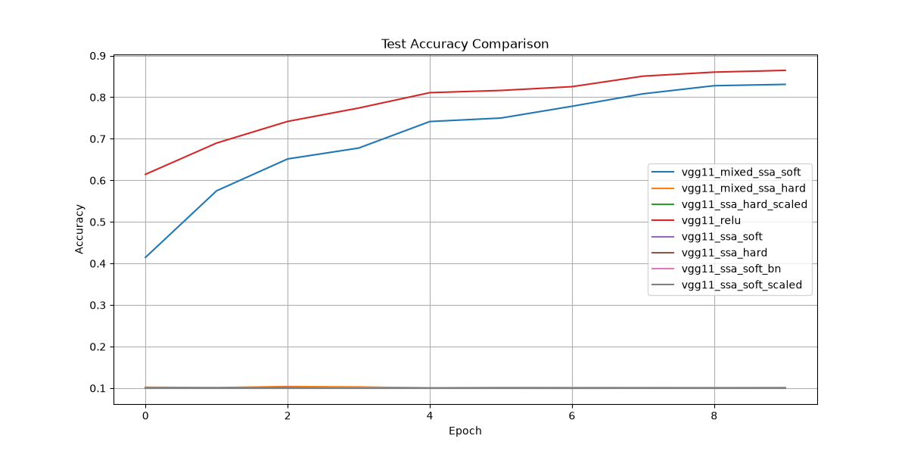

# Research Report: Sampling Neural Network

## 1. Executive Summary
This research investigated the introduction of categorical sampling at intermediate layers of neural networks, a technique we call "Softmax Sampling Activation" (SSA). Inspired by the final softmax layer used for class prediction, SSA treats intermediate activations as logits and samples a neuron to pass forward according to its relative probability. Our experiments on CIFAR-10 show that while deep networks with SSA at every layer are unstable and fail to converge, networks with SSA applied selectively in the final feature layer can train effectively when using differentiable reparameterization (Gumbel-Softmax). However, SSA generally results in lower accuracy compared to standard ReLU, suggesting that the competitive nature of categorical sampling is better suited for decision-making than for feature extraction.

## 2. Research Question & Motivation
The primary research question was: **"What happens if we take the distribution of activations at an intermediate layer and sample from it, similar to the final softmax layer?"**

Stochasticity in neural networks is often used for regularization (Dropout) or uncertainty estimation (Bayesian Neural Networks). This research explored a specific form of stochasticity: **categorical sampling over the feature space**. This approach forces the network to focus on a subset of salient features, potentially acting as a strong regularizer or an attention-like mechanism.

## 3. Methodology
We implemented a custom Softmax Sampling Activation (SSA) module using the Gumbel-Softmax trick to enable backpropagation through categorical samples.

### Baselines
- **Standard VGG-11 with ReLU**: Primary deterministic baseline.

### Experimental Variants
- **SSA (Soft)**: Uses the continuous softmax relaxation from Gumbel-Softmax ($\tau=1.0$).
- **SSA (Hard)**: Uses a discrete one-hot sample during the forward pass (Straight-Through Estimator).
- **SSA (Scaled)**: Multiplies output by the number of channels to maintain activation magnitude.
- **Mixed VGG**: Uses standard ReLU in early layers and SSA only in the final feature layer (layer 8).

### Environment
- **Hardware**: 4x NVIDIA RTX A6000 GPUs.
- **Dataset**: CIFAR-10 (standard 50k train / 10k test split).
- **Training**: 10 epochs, SGD optimizer (LR=0.01, Momentum=0.9), Cosine Annealing scheduler.

## 4. Results

| Method | Test Accuracy (Top-1) | ECE (Uncertainty) | Status |
|--------|-----------------------|-------------------|--------|
| **ReLU Baseline** | **86.46%** | 0.0236 | Success |
| SSA (All Layers, Soft) | 10.21% | 0.0053 | Failed |
| SSA (All Layers, Hard) | 14.23% | 0.0041 | Failed |
| **SSA (Last Layer, Soft)** | **83.09%** | 0.0323 | Success |
| SSA (Last Layer, Hard) | 10.38% | 0.0713 | Failed |

## 5. Analysis & Discussion

### The "Vanishing Signal" Problem
One of the most critical findings was that naive Softmax activations at every layer cause the signal to vanish exponentially. Because Softmax outputs sum to 1.0, the average activation value is scaled down by a factor of $C$ (the number of channels). In a deep network like VGG-11, this attenuation ($1/C^L$) effectively zeroed out all gradients, preventing any learning.

### "Soft" vs. "Hard" Sampling
There is a dramatic difference between soft and hard sampling. In the "Mixed VGG" case, the **Soft SSA** converged to a respectable 83.09% accuracy. In contrast, the **Hard SSA** (which picks exactly one channel to keep) failed to train, sticking at ~10%. This indicates that the gradient variance introduced by hard sampling is too high for the network to handle, especially when the initial distribution is near-uniform.

### Competitive Bottleneck
Even when SSA worked (Mixed VGG), it performed worse than the ReLU baseline (83.09% vs 86.46%). This suggests that forcing neurons to "compete" via a softmax distribution is counter-productive for feature representation. ReLU allows multiple independent features to be active simultaneously, which is essential for representing complex hierarchical data. SSA's "winner-take-all" behavior acts as an information bottleneck that restricts the model's capacity.

## 6. Limitations
- **Epoch Count**: Due to time constraints, models were trained for only 10 epochs. Longer training might have allowed pure SSA models to show some progress.
- **Hyperparameters**: We did not perform an extensive search over temperatures ($\tau$) or learning rates.
- **Initialization**: Standard initialization (He/Kaiming) is designed for ReLU. SSA likely requires a specialized initialization to handle its specific distribution.

## 7. Conclusions & Next Steps
Introducing categorical sampling from intermediate activations is a viable but challenging technique. While it provides a natural form of stochasticity, its competitive nature and scaling issues make it difficult to use as a general-purpose activation function. 

**Recommended Next Steps:**
1. **Temperature Annealing**: Start with high $\tau$ (uniform) and gradually decrease to low $\tau$ (sparse) to stabilize early training.
2. **Residual SSA**: Use SSA as an additive noise component ($y = \text{ReLU}(x) + \text{SSA}(x)$) instead of a direct replacement.
3. **Sparse Attention**: Investigate if SSA is more effective as a spatial attention mechanism rather than a channel-wise activation.
